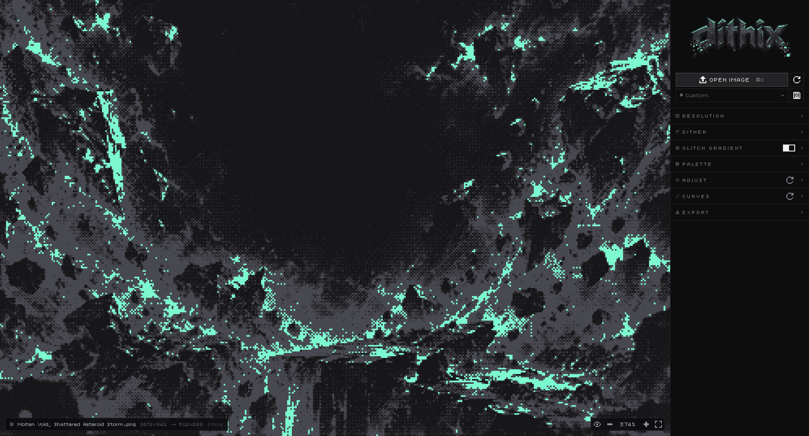

# dithix



Turn any image into dithered pixel art, right in the browser.

## Features

- **25 dithering algorithms**: Bayer 2×2 to 32×32, cluster dot, halftone, lines, blue noise, Floyd–Steinberg, Atkinson, Jarvis–Judice–Ninke, Stucki, Sierra, Riemersma and more
- **Palettes**: 19 built-in (Game Boy, PICO-8, C64, CGA, Zinc Mint…), editable swatches, extract from the image, and save your own
- **Presets**: built-in looks (Classic, Games, Print, Wild) plus your own, with save, overwrite, rename and delete
- **Adjustments**: brightness, contrast, gamma, saturation, invert, and luma/RGB curves
- **Glitch gradient**: dots grow from fine to chunky across the image, scattered so the bands blur together
- **Resolution** by scale, width or height, with smooth, sharp or browser resampling
- **Export** PNG, JPG or SVG at any integer upscale
- **Viewport**: scroll to zoom, drag to pan, hold `Space` to compare with the original

## Privacy

Images are processed locally in a Web Worker and never uploaded. Settings, presets and palettes live in your browser's `localStorage` (`dithix:settings`, `dithix:presets`, `dithix:palettes`, `dithix:ui`).

## Development

```bash
pnpm install
pnpm dev        # http://localhost:3000
pnpm test       # unit tests (Vitest)
pnpm build
```

Built with Next.js, React, Tailwind CSS, Base UI, and zustand + immer.
