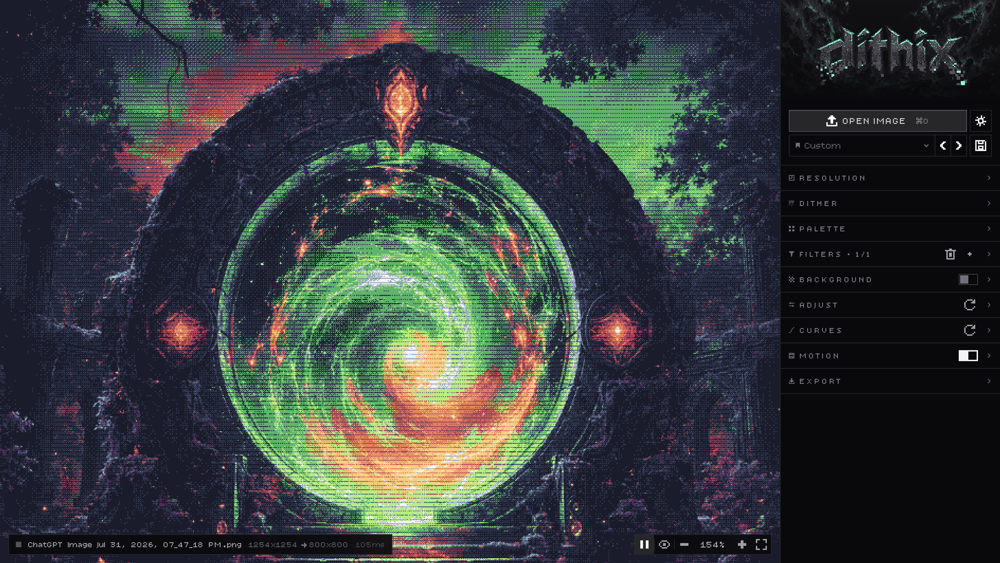

# dithix



Turn any image into dithered pixel art, right in the browser — still or as a looping animation.

## Features

- **25 dithering algorithms**: Bayer 2×2 to 32×32, cluster dot, halftone, lines, blue noise, Floyd–Steinberg, Atkinson, Jarvis–Judice–Ninke, Stucki, Sierra, Riemersma and more
- **Palettes**: 54 built-in, grouped into Basics, Pixel art (DawnBringer, Endesga, AAP-64, Sweetie 16, Zughy 32…) and Retro hardware (Game Boy, NES, PICO-8, C64, CGA, MSX…). Edit swatches with a colour picker that takes hex, `rgb()`, `hsl()`, names or any CSS colour, extract a palette from the image, and save your own
- **Presets**: built-in looks (Official, Classic, Games, Print, Wild, Glitch & FX) plus your own, with save, overwrite, rename and delete. Step through palettes and presets with the ‹ › arrows to compare
- **Filters**: a reorderable stack of 18 — blur, sharpen, posterize, grain, vignette, edge detect, glow, scanlines, wave, swirl, bulge, luma displace, RGB split, pixel sort, slice shift, block glitch, TV glitch and the glitch gradient (dots that grow from fine to chunky across the image)
- **Background**: fill transparent areas with a solid colour, checker, stripes, dots, grid, gradient, or a tile you draw yourself, starting from Bayer, cluster or line patterns
- **Adjustments**: brightness, contrast, gamma, saturation, hue, invert, and luma/RGB curves
- **Motion**: turn the image into a seamless loop with pattern crawl, hue cycling, brightness pulse, boil (re-rolled noise and glitches) and animated filters
- **Resolution** by scale, width or height, with smooth, sharp or browser resampling
- **Export** PNG, JPG or SVG at any integer upscale; animations as looping GIF (exact palette colours), MP4 or animated SVG
- **Viewport**: scroll to zoom, drag to pan, hold `Space` to compare with the original, play/pause the loop
- **Backup**: export and import your settings, presets and palettes as JSON

## Privacy

Images are processed locally in a Web Worker and never uploaded, unless you publish a result to the gallery (then only the dithered 1× PNG or GIF and its settings are sent; never the original). Settings, presets, palettes and recent colours live in your browser's `localStorage` (`dithix:settings`, `dithix:presets`, `dithix:palettes`, `dithix:ui`).

## Gallery

Users can publish the current result (a 1× PNG, or a GIF of the loop) with a title, their name and the look's settings. Posts stay hidden until approved on `/admin`; anyone can then use a post's look or save it as a preset.

Setup on Vercel:

1. **Storage → Marketplace → Neon**: connect a Postgres database to the project (sets `DATABASE_URL`). The table is created on first use; posts and their images (small 1× files) are both stored there.
2. Add `GALLERY_ADMIN_TOKEN`: a long random secret (at least 16 characters, e.g. `openssl rand -hex 32`). Sign in with it on `/admin` to approve, reject or take down posts.

For local development, `vercel env pull .env.local` copies the variables down.

## Development

```bash
pnpm install
pnpm dev        # http://localhost:3000
pnpm test       # unit tests (Vitest)
pnpm build
```

Built with Next.js, React, Tailwind CSS, Base UI, and zustand + immer. MP4 export uses the browser's WebCodecs encoder via [Mediabunny](https://mediabunny.dev/).
